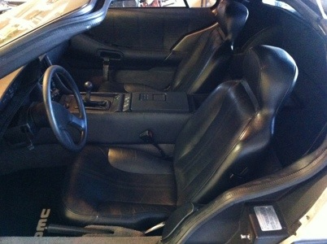

Today I took the seat tracks off the seats, cleaned and lubed them, and added some more washers to help them clear the carpet when sliding. The seats move nice and freely now – they had been binding on the carpet since I installed the dynamat under it.

Tomorrow is a big day! Clint’s coming over in the morning and barring any additional tragedies, we should be driving by lunch. Can’t wait!