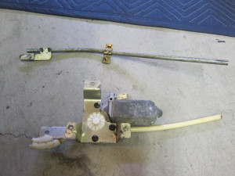
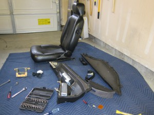

So I’ve known since I got the car that the power window regulators were original and very failure prone. But I had been lucky, up until a few weeks ago when the driver’s side motor started clicking. This generally indicates imminent doom, but I decided to tempt fate and leave it be for now.

Since it was such a nice day yesterday, I decided to take a spin around town. Being a nice day, I also decided to put down my windows – as people often do. I thought “one more use won’t kill me”

How wrong I was. The window lowered about 1/4th of the way and then there was a terrible sound of splintering plastic as it dropped all the way to the bottom of the door. Sigh….

The worst part is that the price for the regulators recently jumped a huge amount. The DMC vendors sell them for about $300 each side, while the manufacturer had been selling them directly for about $319 for the set of two. But in the last six months the price jumped to almost $500 for the pair! I really wish I hadn’t held off on fixing these. But a phone call to the manufacturer (A1 Electric) and a little schmoozing netted me a bit of a discount. Not quite back to the old price but still a bit of a savings that I was glad to have. The new motors should be here early next week. I only plan to do the driver’s side right now since working inside these doors is a real pain in the butt.

Here’s a photo of what’s left of my original regulator – notice the cheap plastic elbow and worm gear guide. The elbow had snapped and the worm gear had coiled up at the bottom of the door as the window came down. The breaking plastic noise was a combination of the elbow snapping and the (also plastic) gears inside the mechanism coming apart. Fortunately the window itself, and more importantly the carrier are still just fine.

And a shot of all the dismantled door and interior parts… yet again…

More updates to come as the parts arrive…