Been a while since my last post, but there are a couple of really big ones coming!

So about a week before the UC Davis parade, I noticed a little drip of coolant under the front of the car. I wasn’t too concerned as the weather was just starting to heat up, and it’s pretty common for me to have to snug up a few hose clamps as the warmer temperatures cause things to swell a little. Unfortunately, this time it appeared that the drip was coming not from a hose junction, but right from the radiator. It had been on my list for a while to replace this anyway, so I ordered a beautiful new replacement from Ed Uding in the Netherlands.

[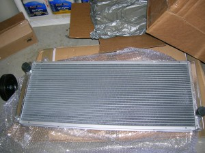](../assets/images/2013/06/DSCN4175.jpg)

[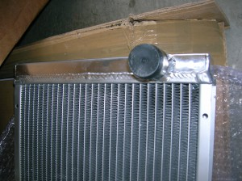](../assets/images/2013/06/DSCN4176.jpg)

Here’s the new radiator. It’s got about 10% more surface area than the one I removed. A common failure point on the OEM DeLorean radiator was the plastic side tanks that were crimped to the metal body. Over time those tanks would crack and leak from all the heat cycling. While my current radiator was not OEM and did in fact have metal tanks, this new design is superior. Instead of having crimped side tanks, these are well and truly welded in place. There is no way those will ever leak.

[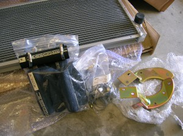](../assets/images/2013/06/DSCN4178.jpg)

And it wouldn’t be a DeLorean repair without a few “while you’re in there” jobs – so I’m also replacing the lower mounting brackets (mine were bent way upwards long ago, probably by a previous owner hitting a curb) as well as every rubber hose and hose clamp in the entire coolant path.

[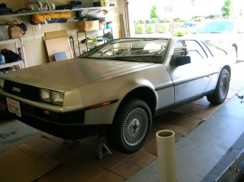](../assets/images/2013/06/DSCN4174.jpg)

Step 1 – jack up the front end. I call this the “OEM Suspension” pose 🙂

[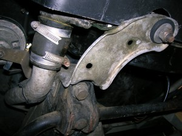](../assets/images/2013/06/DSCN4179.jpg)

Here’s where the drip was coming from – right behind this small hose junction. After I removed the radiator it became clear that the drip actually \*was\* coming from the hose and that the radiator was totally fine. But, that just means it made a nice gift for Clint.

[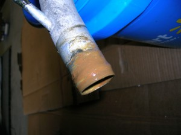](../assets/images/2013/06/DSCN4182.jpg)

[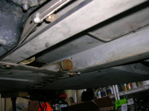](../assets/images/2013/06/DSCN4191.jpg)

After removing the rubber hoses, this is the mess that greeted me on, around and inside all of the aluminum coolant pipes. I had to remove every one from the car and thoroughly clean and polish them to remove all the corrosion and sediment.

[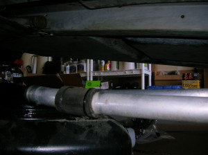](../assets/images/2013/06/DSCN4190.jpg)

Here are some pipes after a fresh polish at the tips. Tough to compose a photo under the car, sorry!

[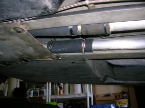](../assets/images/2013/06/DSCN4192.jpg)

And some brand new hoses. Should be good for another few decades, at least.

[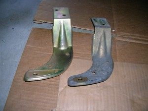](../assets/images/2013/06/DSCN4183.jpg)

Old and new lower radiator brackets. The bend isn’t immediately obvious here because I had used a pry bar to try and get the existing ones lined up many moons ago. But I was worried about any misalignment in these brackets potentially tweaking the new radiator and decided to just replace them rather than find myself sorry later. Besides, that fresh yellow zinc plating just looks so good!

[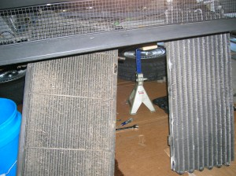](../assets/images/2013/06/DSCN4184.jpg)

One of the bigger hassles of this job is getting the air conditioning condenser out of the way carefully. The radiator is sandwiched between the condenser and the fans, but since I don’t want to disconnect the refrigerant hoses, some careful maneuvering is required. Here you can see the old radiator standing on the left and the condenser on the right.

[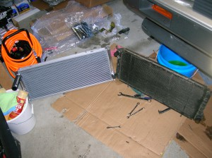](../assets/images/2013/06/DSCN4185.jpg)

[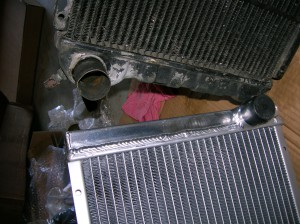](../assets/images/2013/06/DSCN4186.jpg)

With the old radiator finally removed, it’s time for a comparison shot! You can see how much nicer the new unit is. Note the crimped tanks on the old black unit.

[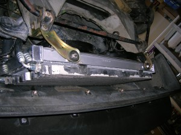](../assets/images/2013/06/DSCN4188.jpg)

[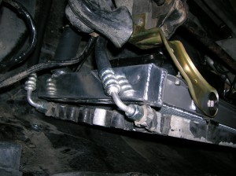](../assets/images/2013/06/DSCN4189.jpg)

All done! Here’s the new radiator and new lower brackets, mounted between the fans and condenser. The fans are also new, but the condenser is original. It works perfectly but is ugly as sin. Not really much point in replacing that, sadly. I also need to get that sway bar powder coated, as it is the only rusty part on the whole car.