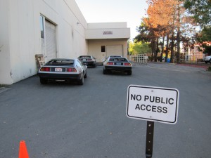
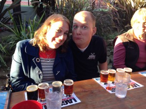

Another awesome excursion with the club guys. This time around it was myself and Kate, Rich and Kathy, David and Heather and Brian and Kaylee. Let’s start out with the route for what turned out to be the best drive we’ve taken yet.

In our particular case, Kate and I started in Vacaville. We met David and Heather in Fairfield and continued on to Petaluma to meet the rest of the crew.

We met up at a Peet’s Coffee, where we ran into a kindred spirit with another John DeLorean designed car. After sharing some stories, he gave us a few tips on scenic roads for our drive and we started on our way.

Here’s where we had our one malfunction of the day – Brian popped the fuse for his fuel pump. A very quick replacement later and we were all back in business.

Our first stop from there was Guerneville, for a quick walk around the small town and some scenery.

Then, it was back on the road to our next stop in Monte Rio for lunch. Here’s a snap of Rich leading the way!

And here’s where we ended up eating – Don’s Dog Cafe. The food was actually pretty good and the ambiance and company were perfect. Thanks to David for this pic, I forgot to take any of the restaurant itself – I was too busy being impressed by Heather’s choice of meal. Yes, she ate every bite.

The next stop was the visitor’s center in Jenner, where we parked at the boat launch for a quick photo opp…

After that, it was back to our old haunt – Goat Rock Beach. This place never gets old, though as Rich said “it could be more scenic…”

Most of us were looking pretty photogenic on this trip. Rich and Kathy were a little camera shy, I guess!

On the way to our next stop, we drove through the town of Bodega Bay. Kate thought the huge stacks of crab traps were really cool…

The following beach stop was at Bodega Head, where we all (most) had a chance to be photogenic again!

Now, we come to the best part of the drive. We had decided to cap off the trip with a stop at the Lagunitas Brewing Company in Petaluma. This was a spur of the moment type thing and we had no prior arrangements or specific expectations, other than to go get a beer – and we had heard they had a fun tour. We had no idea what was in store for us…

On our arrival, the first thing we noticed was the utter lack of parking. The lot was fairly small to begin with, but it was also completely packed to overflowing. Fortunately, 4 DeLoreans tend to make a bit of a scene wherever they go, and once the tour guide spotted us, this happened….

Celebrity treatment, we thought. Safe parking – what more could we ask for? We walked inside, found a table in the beer garden and ordered a few flights.

I told David to make a new face for this picture. That’s what he came up with.

Speaking of flights, the Fusion 24 and the Born Yesterday were awesome. Anyway, about 10 minutes into our relaxation we were paid a visit by a local raconteur going by the name of Johnny Lightning. He told us it was his job to look after VIP guests (?!) such as ourselves, and that once we finished up with our drinks, he’d be happy to take us to the employee lounge, pull us a few pints and give us the inside story on the brewery before putting us on an official tour. He delivered.

More Fusion 24, by the way. That stuff is great. Anyway, after a good long bull session and history lesson we joined the tour. Here’s Kate enjoying her Hop Stoopid 🙂

Now on to the rest of the tour…

The most important pipeline in that whole building…

Anyway, once we wrapped up the tour, our host Johnny asked us if we’d mind pulling the cars into the production area, for a few photos. All the stainless tanks with the stainless cars were something that he and the brewer were really interested in capturing. Of course, we are always only too happy to oblige such requests, especially when we are being treated like rock stars!

And, for our trouble (what little trouble it was to drink free beer and have people take our pictures) – a case of Lagunitas Sucks. Which is also delicious, by the way.

After that, it was back to the highway and home! We put on about 220 miles total, and the cars performed wonderfully. With the exception of Brian’s fuel pump fuse and a loose interior light fuse in Rich’s car, no one had a single issue. 8BIT even managed to get 27 MPG over the course of the trip, even with all the low gear twisty driving. Long drives like this are my reward for all the countless hours and small fortune I’ve poured into making my car so reliable.

Thanks to Rich for helping plan this whole thing and being our navigator, Brian, Kaylee, David, Heather, Kathy and Kate for just being generally cool to hang out with – and Lagunitas for making this a really memorable event!